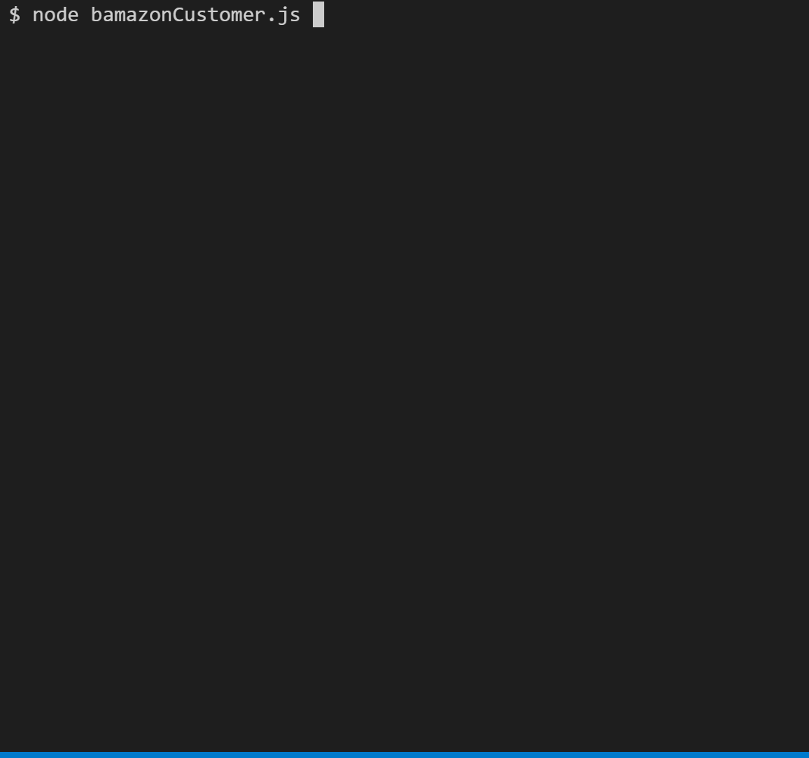

# BAMazon
Using Node.js and MySQL, create a command line app mimicking an inventory tracking system for purchases by a user. This is all part of a homework assignment for UCLA's Fullstack Web Development Coding Bootcamp (September 2019 to March 2020).

## BAMazon Functionality
When the program is run in node, a user is shown a list of all currently available inventory, in the format of **ID # | Item Name - Price.**

`Note that the inventory list will only display items with a stock greater than 0. Once an item has no stock, it will not display on the list.`

Once the current inventory list is displayed, the user is prompted for an inventory ID number (**? Input the ID of the product which you would like to purchase:**). If a user inputs a number larger than what's defined in the program as being the largest inventory ID number, or inputs anything not a number, the app will respond with **Please enter a valid product ID number. Press up arrow key and delete the invalid entry to input a new product ID.**

After a valid product ID has been input, the program asks for a quantity (**Input the number of units you would like to purchase:**). As with the product ID, if something not a number, or something higher than the pre-set limit for quantity is entered, the app will respond with **Please enter a valid number. Press up arrow key and delete the invalid entry to input a new quantity.**

With a successful input of a valid ID and quantity, the user will meet one of two results. If the quantity requested is greater than the stock in supply, the user will see **Insufficient quantity in stock.** and be shown the full product list again, prompted for a new ID and quantity.

If the quantity requested is less than or equal to the stock in supply, the user will see a success message:

`1 order(s) for [Product] at [Cost] successfully submitted.`

And a secondary message:

`Your order total is now [Total Cost of All Orders].`

The Total Cost of All Orders will adjust if a user continues making purchases. Basic sales tax is included (for the state of California), so costs between inventory list and success message cost will be different.

After a successful order, users will be prompted **Would you like to make another purchase?** If they input Y or Yes, they'll be shown the full inventory list again, and prompted for a product ID. If they input N or No, the program will cease running.

## BAMazon Dependencies
* inquirer
* mySQL

## Languages Used
* JavaScript

## BAMazon stretch goals
* Further develop the validation checks (find the largest product ID with stock and set it as the upper limit).
* Create a manager application which can review, add, and otherwise manage inventory.
* Create a supervisor application which monitors overhead costs, product sales, and total sales by department.
